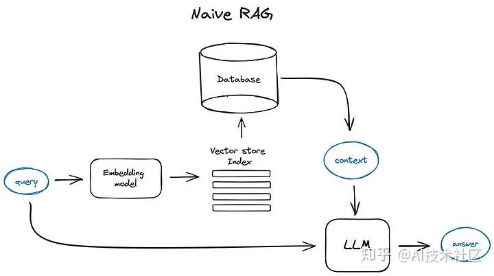
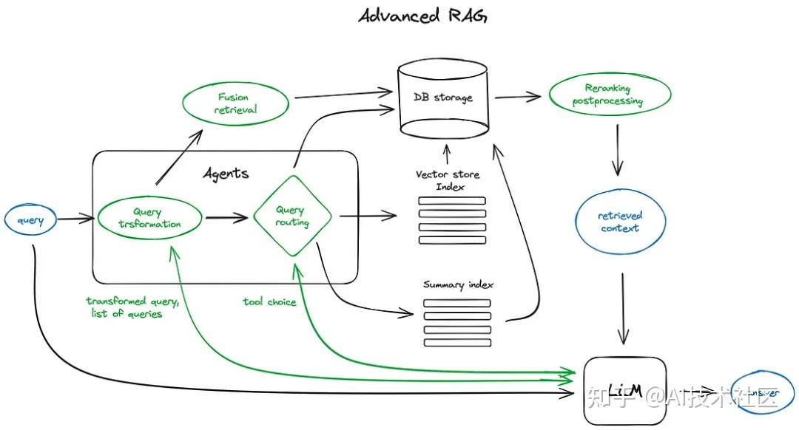
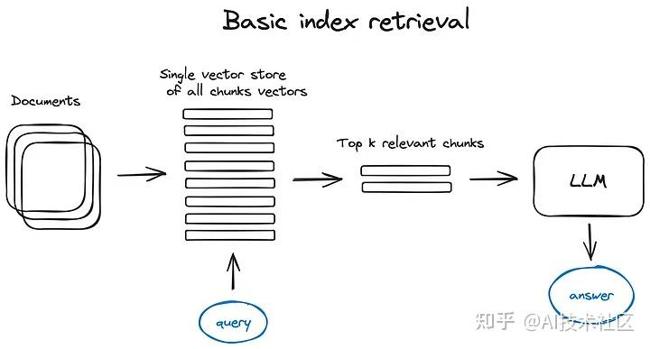

# RAG

## Basic RAG

### Structure 


### Code example
```
def question_answering(context, query):
    prompt = f"""
                Give the answer to the user query delimited by triple backticks ```{query}```\
                using the information given in context delimited by triple backticks ```{context}```.\
                If there is no relevant information in the provided context, try to answer yourself, 
                but tell user that you did not have any relevant context to base your answer on.
                Be concise and output the answer of size less than 80 tokens.
                """

    response = get_completion(instruction, prompt, model="gpt-3.5-turbo")
    answer = response.choices[0].message["content"]
    return answer
```
___
## Advanced RAG

### Structure


### Steps

#### Chunking and vectorisation

##### Chunking  
Use Tokenizer Model to cut paras.

##### Vectorisation
1. Use Embedding Model to vectorize the text chunks.
2. Generate the vectors, which contain the information of the text itself.
3. Store the vectors into the vector DB or Index.

#### Search the index

##### Basic index retrieval (vector-stored index)

###### Structure
  
In order to keep the simplicity of the scheme, the Encoder  is omitted and the query was sent directly to the index. The query has been converted to vector form before that. 

###### Methods of index
1. Flat
2. Faiss
3. Nmslib
4. Annoy  
***These indexes use approximate nearest neighbour methods such as clustering, tree structure or HNSW algorithms.***  
**Hosted Solutions**  
OpenSearch & ElasticSearch
