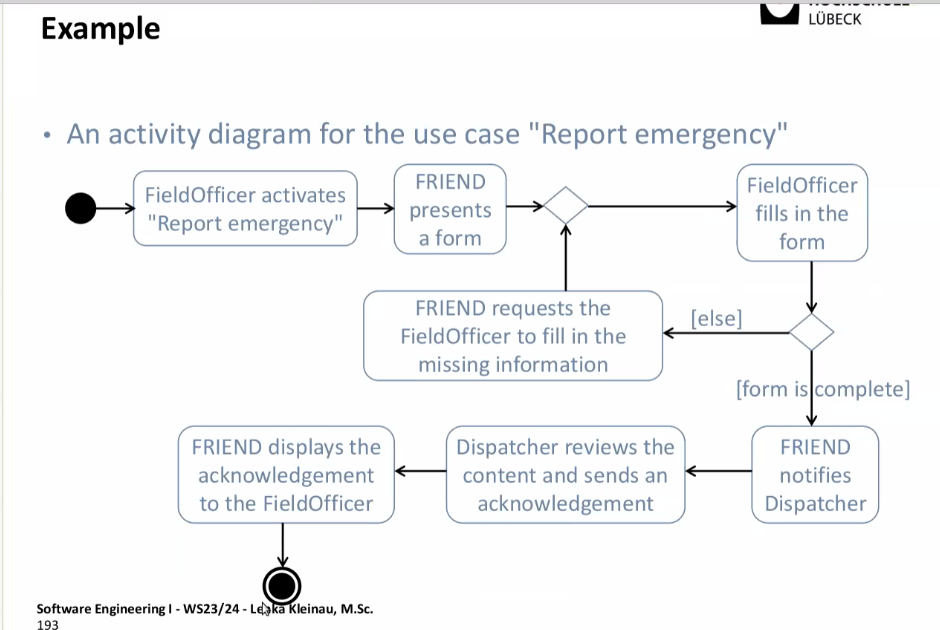
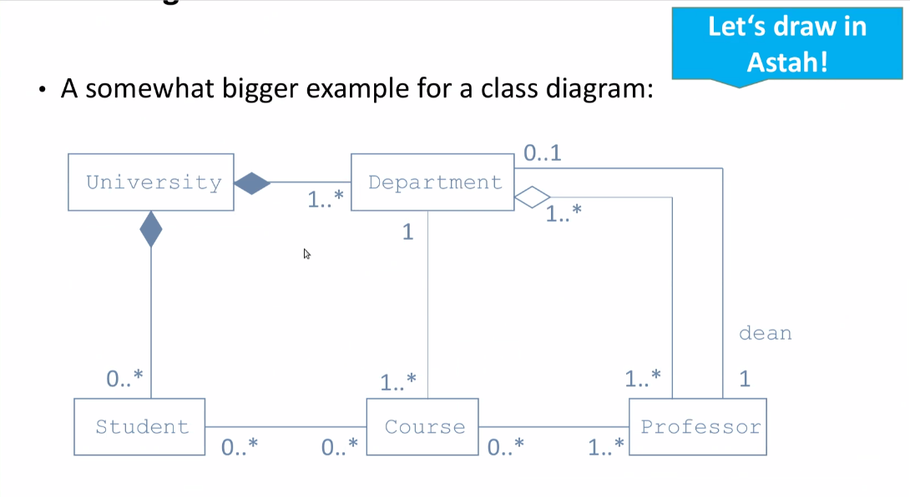
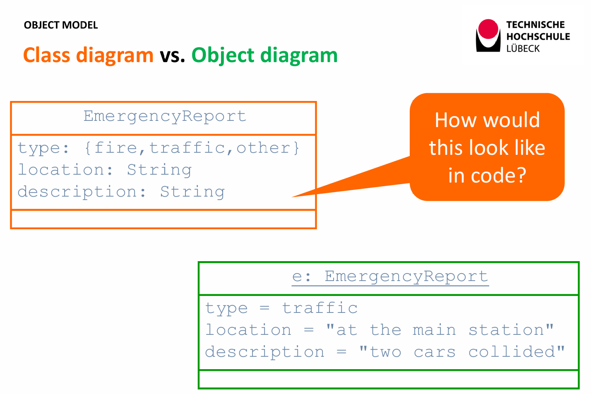
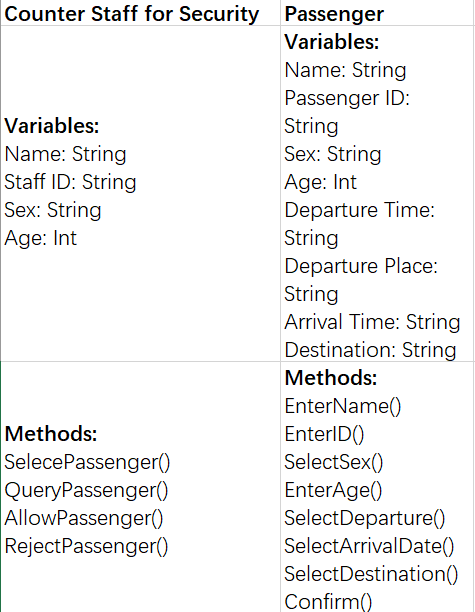

# Software Engineering  

# I

## Major steps in system development
### 1. Requirement engineering (Most critical in Software Engineering)  
**Object: Figure out what we want to achieved**  

***What is requirement?***  

1. A list of items  
2. Schedule (time involved)  
3. What is wanted (from both sides, agreement)  

#### Techniques
1. Documentation  
2. Interview
- Boss
- Employees
3. Participating observation  

#### Side-conditions
1. Commercial
2. Emotional
3. Political
4. Mental (Tacit knowoledge)

#### What are the possible techniques for to figure out what is needed (Requirement engineering)?
1. Check documentation
- Job description 
- Protocols of meetings
- Process descriptions
2. Interviews of stakeholders 
3. Participating observation (become part of the system)  

#### What are the challenges of Requirement engineering?
1. Commercial Challenge 
   ->Time of stakeholders (employees) is needed: put the needed time of the employees into contract.  
2. Emotional challenge 
   ->People may be disturbed from whatever: get specialists.  
3. Political challenge 
   ->Second agendas can be discovered by cross checking (asking colleagues).  
4. Mental (tacit knowledge) 
   ->Only chance is participating observation.  

#### What aspects define the quality of a requirement?
1. Completeness: No feature of interest is missing
2. Consistency: No two requirements contradict with each other
3. Unambiguous: Each requirement can be interpreted in only one way
4. Correctness: No unintended feature is described  

### 2. Software design
**Object: Cutting down the big tasks into smaller ones that can run independently.**  

#### What is the role of models of application domain? (Model of the real world)
1. It structures the heap of information we have gathered.
2. It emphasizes the important aspects.
3. It makes the information specific (Nails it down)

#### What basic type of models are we dealing with(do we use)?
1. Models of the real world (application domain).
2. Models in our system (Solution domain).

#### What are the core characteristics of a model?
A model emphasizes certain aspect and leaves aside other aspects.

#### How are these models written?
Most types of the software are written in Unified Modeling Languages (UML)

##### What types of models are important for our system?
1. Functional model: to deal with events from outside perspective 
2. Object model: the components used in the program 
3. Dynamic model: how do the components of our program interact  

### 3. Implementation
**Object: The coding itself.**  

### 4. Validation
**Object: Check whether it meets the requirements.**  

___
## Use-case
***1. Name***
***2. Actor***
***3. Trigger***
***4. Precondition*** 
***5. Activity***
***6. Postcondition*** 

### How to identify a use-case? 
1. What is the name of the use-case?
2. Who is the actor (can be human or technical)?
3. Is there a precondition and a postcondition to be named?
4. What makes the postcondition out of the precondition?
5. What starts the whole process (trigger)?
6. Whether there are sub use-cases under the parent use-case? 

### Identifying relationships among actors and use-cases. 
1. Drawing a use case diagram
2. Graphical elements: SWEI-PDF 3, Page 45  
- A stickman represents an actor
- Bubbles represent events
- Arrows 

### Use-cases can be inclusive or extended 
1. Inclusive use-cases are necessary 
2. Extended use-cases are possible

*Decorating a dish of rice: extension of cooking rice* 
*Cutting vegetables before cooking: inclusion necessary*   

___
## ✨Use-case Diagram (PDF 4)
### 1. Dispatcher (Actor)
### 2. Field Officer (Actor)
### 3. Use-cases  
___
##  ✨ Activity Diagram (Static)
##### 1. Decision node & Merge node 💠	(single process)  
##### 2. Fork node & Join node ｜	(multiple process)  , followed by <u>conditions</u>
##### 3. Conditions[ ]  
##### 4. Initial node	·  
##### 5. Action node □   
##### 6. Flow → (single) & ⇢ (multiple)  

###### Objects 
1. real world objects
2. class
3. instantiated objects

### Example

___
## ✨Class Diagram (Dynamic)
#### Multiplicity
e. g. 
1..* means 1 or more 
0..* means 0 or more  

### Example

#### Composite 
Diamond node to show a strong inclusion relationship   

##### What is the difference between a decision node and a merge node on the one hand and fork node with a join node on the other hand? 
1. The decision & merge node there is a condition
2. Fork & join node there is no condition

##### What is the difference between a decision node and a fork node not in UML? 
1. Fork node works unconditionally. Results in processing.
2. Decision node works conditionally. Only one branch after it is followed.

##### What are the nodes called that get the multiple branches after a decision node or a fork node together again? 
1. Decision node: merge node.  
2. Fork node: join node.  
___
####  Example

####  Difference between Address and Reference
##### Explanation
   - **Address**
     - 在类图（Class Diagram）中，“address”通常涉及到对象在内存中的位置信息。当一个对象被创建时，它会在计算机内存中有一个特定的存储位置，这个位置可以被看作是对象的“地址”。例如，在编程语言中，像C或C++，可以通过指针来操作对象的地址。在类图层面，这可能不太直观，但在理解对象之间的关联和存储关系时很重要。如果有一个对象数组，每个元素在内存中都有自己的地址，这有助于定位和访问特定的对象。
   - **Reference**
     - “reference”是一种更高级别的概念，它表示一个对象对另一个对象的引用关系。在面向对象编程和类图中，一个对象可以持有对另一个对象的引用，这意味着它可以通过这个引用访问和操作被引用的对象。例如，在Java中，对象之间的关联通常是通过引用实现的。如果有一个“Customer”类和一个“Order”类，一个“Customer”对象可能会有一个对“Order”对象的引用，表示这个顾客的订单。引用可以是单向的，也可以是双向的，具体取决于业务逻辑和对象之间的关系。
##### Difference
   - **Address关联特点**
     - 地址关联相对更底层。如果从内存角度考虑，它主要用于描述对象物理存储位置之间的关系。例如，在一个系统中存储用户信息和订单信息，不同用户对象和订单对象在内存中的地址分布情况可能会影响系统的性能和存储效率。但是，在类图的高级设计层面，一般不会直接体现对象的内存地址关联，除非是在非常底层的系统设计或者涉及到内存管理相关的特定场景。
   - **Reference关联特点**
     - 引用关联在类图中是很常见的一种关系表示。它用于构建对象之间的逻辑关系。比如，在一个学校管理系统的类图中，“Teacher”类和“Course”类之间可能存在引用关系，一个“Teacher”对象可以引用多个“Course”对象，表示这个老师教授的课程。这种引用关系可以通过类图中的关联线（如简单关联、聚合、组合等）来清晰地表示，并且可以标注关联的多重性（如1对多、多对多等），以准确地描述对象之间的引用规则。
##### Difference in  Class Diagram
   - **Address在类图中通常不直接表示**
     - 因为类图主要关注的是软件系统的高层逻辑结构和对象之间的逻辑关系，而不是对象的内存布局。不过，在一些特殊情况下，如涉及到分布式系统的存储结构或者非常底层的系统架构类图中，可能会用一些自定义的符号或者注释来暗示对象存储位置（地址）相关的信息。但这不是类图的常规做法。
   - **Reference在类图中有明确表示方法**
     - 引用关系在类图中有多种标准的表示方式。如果是简单的关联引用，用一条直线连接两个类来表示它们之间存在引用关系。例如，“A”类和“B”类之间有引用关系，就用一条直线从“A”类指向“B”类。如果是聚合关系（一种特殊的引用，整体与部分的关系，部分可以脱离整体存在），用空心菱形加直线表示；组合关系（一种强关联的引用，部分不能脱离整体存在）用实心菱形加直线表示。并且可以在关联线上标注角色名称、多重性等信息来详细描述引用关系。

e. g.

___
#### Some concepts

##### Object classes

*Contain preconditions and the postconditions
(model)*

##### Boundary classes

*Important for communication and interfaces
(view)*

##### Control classes

*Bring the functionality
(control)*

##### MVC model

*model, view, controller*

___
## Object diagram

___
## Sequence Diagram 